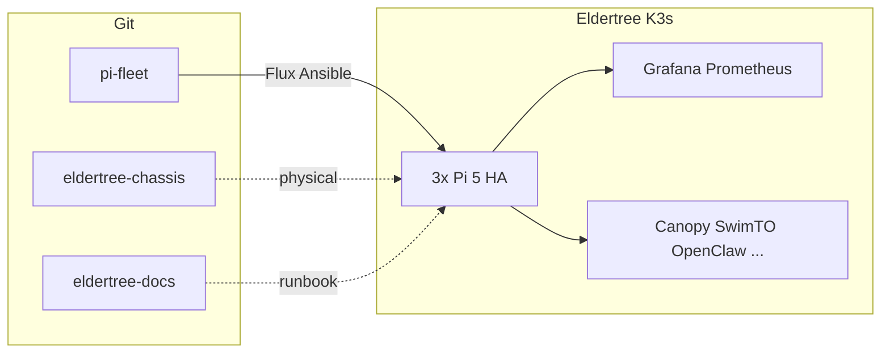

# ElderTree project

**Eldertree** is a 3-node HA K3s cluster on Raspberry Pi 5 hardware in a portable open-frame tower ([eldertree-chassis](https://github.com/raolivei/eldertree-chassis) CAD, private repo).

## Live status

Open these while on the home LAN (or Tailscale):

| View | Link |
|------|------|
| **Ops home** | [Grafana — Eldertree Ops Home](https://grafana.eldertree.local/d/eldertree-ops-home) |
| **Cluster** | [Grafana — Cluster overview](https://grafana.eldertree.local/d/eldertree-cluster) |
| **Hardware** | [Grafana — Pi health](https://grafana.eldertree.local/d/hardware-health) |
| **Command center** | [Grafana — Command center](https://grafana.eldertree.local/d/eldertree-command-center) |

From a pi-fleet checkout:

```bash
export KUBECONFIG=~/.kube/config-eldertree
./scripts/operations/eldertree-open.sh   # prints nodes + opens Grafana + this page
```

## Repositories

| Repository | Purpose |
|------------|---------|
| [pi-fleet](https://github.com/raolivei/pi-fleet) | Cluster IaC, Ansible, Flux, monitoring |
| [eldertree-chassis](https://github.com/raolivei/eldertree-chassis) | Mechanical CAD, BOM, assembly |
| [eldertree-docs](https://github.com/raolivei/eldertree-docs) | This site (runbook) |

Canonical ops map in pi-fleet: [ELDERTREE.md](https://github.com/raolivei/pi-fleet/blob/main/docs/ELDERTREE.md).

## Physical stack

| Layer | Component |
|-------|-----------|
| UPS / portable power | EcoFlow River 3 |
| Network | TP-Link TL-SG1008MP (8× PoE+) |
| Compute | 3× Raspberry Pi 5 (8GB), NVMe boot, PoE+ NVMe HAT |

Details: [Chassis assembly runbook](/runbook/hardware/chassis) · [HARDWARE_CHASSIS (pi-fleet)](https://github.com/raolivei/pi-fleet/blob/main/docs/HARDWARE_CHASSIS.md).

## Nodes

| Node | Wi‑Fi | eth0 (cluster) |
|------|-------|----------------|
| node-1 | 192.168.2.101 | 10.0.0.1 |
| node-2 | 192.168.2.102 | 10.0.0.2 |
| node-3 | 192.168.2.103 | 10.0.0.3 |

**VIP:** API `192.168.2.100` · Ingress `192.168.2.200` · DNS `192.168.2.201`

## Software map



## Incident response

When something breaks, use the [runbook](/runbook/) (search with `/` or `Ctrl+K`).
