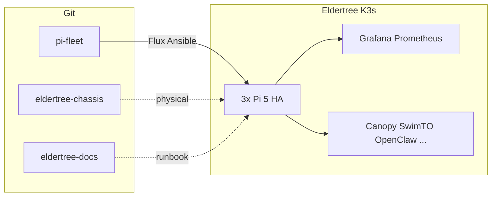

# ElderTree Project

**ElderTree** is a production-grade, self-hosted Kubernetes platform built on Raspberry Pi 5 hardware. It runs personal applications, experimental AI workloads, and serves as a learning environment for modern infrastructure patterns.

**Architecture:** 3-node HA K3s cluster in a portable open-frame tower ([eldertree-chassis](https://github.com/raolivei/eldertree-chassis) CAD, private repo).

## Philosophy

- **Self-hosted first** — own your data, infrastructure, and learning
- **GitOps native** — all state in Git, declarative configuration
- **Observability-driven** — Prometheus/Grafana before guessing
- **Production practices on Pi** — HA, monitoring, secrets management, disaster recovery

## Live status

Open these while on the home LAN (or Tailscale):

| View | Link |
|------|------|
| **Ops home** | [Grafana — Eldertree Ops Home](https://grafana.eldertree.local/d/eldertree-ops-home) |
| **Cluster** | [Grafana — Cluster overview](https://grafana.eldertree.local/d/eldertree-cluster) |
| **Hardware** | [Grafana — Pi health](https://grafana.eldertree.local/d/hardware-health) |
| **Command center** | [Grafana — Command center](https://grafana.eldertree.local/d/eldertree-command-center) |

From a pi-fleet checkout:

```bash
export KUBECONFIG=~/.kube/config-eldertree
./scripts/operations/eldertree-open.sh   # prints nodes + opens Grafana + this page
```

## Repositories

| Repository | Purpose |
|------------|---------|
| [pi-fleet](https://github.com/raolivei/pi-fleet) | Infrastructure as Code — Ansible, Flux, Helm, Terraform, monitoring stack |
| [eldertree-chassis](https://github.com/raolivei/eldertree-chassis) | Mechanical CAD, BOM, assembly guide, hardware design |
| [eldertree-docs](https://github.com/raolivei/eldertree-docs) | This documentation site — architecture, operations, runbook, learning resources |
| [ollie](https://github.com/raolivei/ollie) | Workspace assistant — RAG over org docs; shared memory for Cursor + Claude |
| [workspace-config](https://github.com/raolivei/workspace-config) | Ports, conventions, [Ollie workstation setup](https://github.com/raolivei/workspace-config/blob/main/docs/OLLIE_WORKSPACE_SETUP.md) |
| [pi-fleet-blog](https://github.com/raolivei/pi-fleet-blog) | Build diary, technical blog, lessons learned |

**Cross-reference:** Canonical ops map in pi-fleet: [ELDERTREE.md](https://github.com/raolivei/pi-fleet/blob/main/docs/ELDERTREE.md).

## Physical stack

| Layer | Component |
|-------|-----------|
| UPS / portable power | EcoFlow River 3 |
| Network | TP-Link TL-SG1008MP (8× PoE+) |
| Compute | 3× Raspberry Pi 5 (8GB), NVMe boot, PoE+ NVMe HAT |

Details: [Chassis assembly runbook](/runbook/hardware/chassis) · [HARDWARE_CHASSIS (pi-fleet)](https://github.com/raolivei/pi-fleet/blob/main/docs/HARDWARE_CHASSIS.md).

## Nodes

| Node | Wi‑Fi | eth0 (cluster) |
|------|-------|----------------|
| node-1 | 192.168.2.101 | 10.0.0.1 |
| node-2 | 192.168.2.102 | 10.0.0.2 |
| node-3 | 192.168.2.103 | 10.0.0.3 |

**VIP:** API `192.168.2.100` · Ingress `192.168.2.200` · DNS `192.168.2.201`

## Software map



## Using This Documentation

**Learning:** Explore architecture pages, design decisions, and reference documentation to understand how ElderTree works.

**Operations:** Follow deployment guides, configuration references, and management procedures for day-to-day cluster operation.

**Troubleshooting:** When something breaks, search the [runbook](/runbook/) using `/` or `Ctrl+K` to find matching issues and resolution steps.

**Development:** See [pi-fleet](https://github.com/raolivei/pi-fleet) for contributing to infrastructure code, or [eldertree-docs](https://github.com/raolivei/eldertree-docs) to improve documentation.

## What ElderTree Runs

**Applications:**
- [Canopy](https://github.com/raolivei/canopy) — Personal finance dashboard (CAD/USD, portfolio tracking)
- [SwimTO](https://github.com/raolivei/swimTO) — Toronto community pool schedule aggregator (MIT licensed)
- [OpenClaw/Elder](https://github.com/raolivei/elder) — Cluster management AI agent

**Decommissioned:** [Visage](https://github.com/raolivei/visage) *(archived 2026-04)* — was self-hosted AI headshots; see `workspace-config/docs/PROJECT_DECOMMISSIONING.md`.

**Platform Services:**
- HashiCorp Vault (secrets management)
- Prometheus + Grafana + Loki (observability)
- Cert-Manager (TLS certificates)
- Cloudflare Tunnel (external access)
- Pi-hole (DNS filtering)
- Longhorn (distributed storage)
